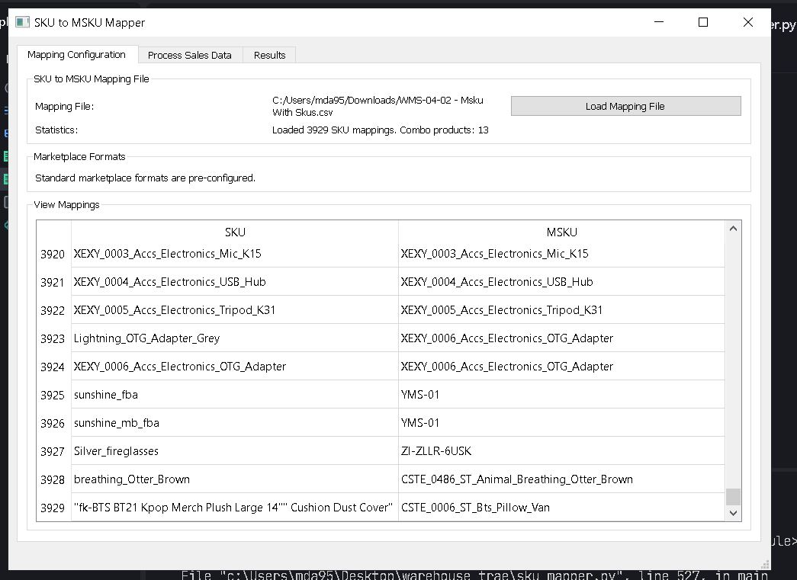
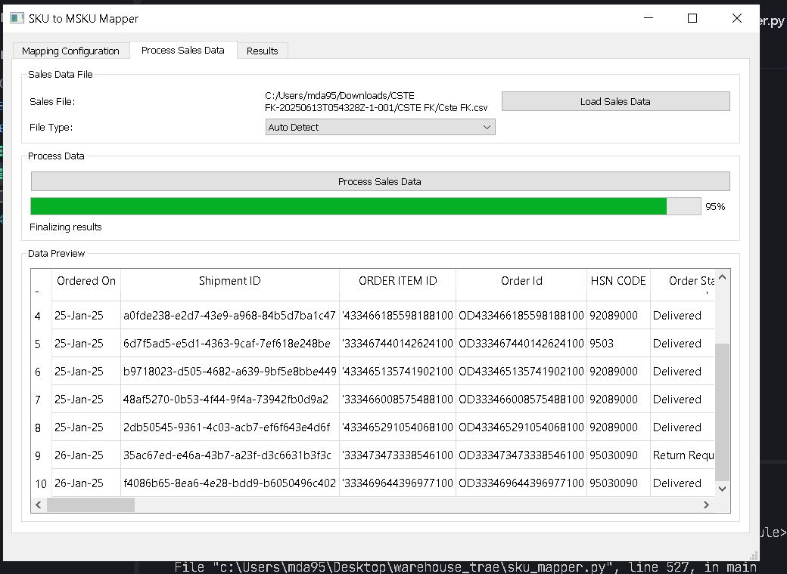
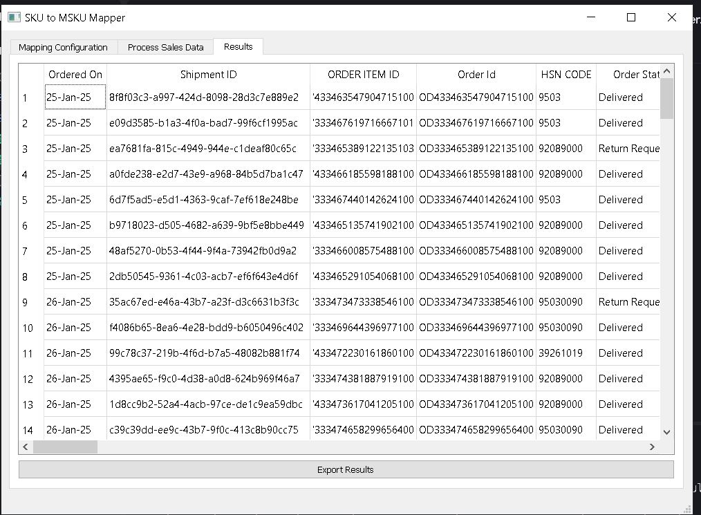
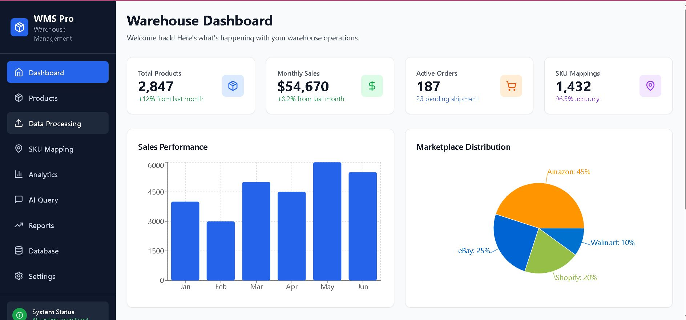
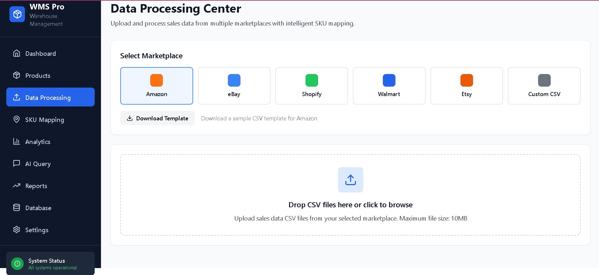
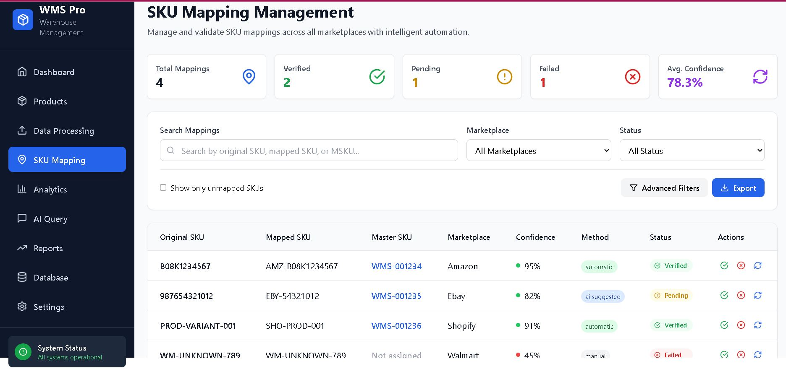

# Warehouse Management System (WMS Pro)

A comprehensive warehouse management solution with intelligent SKU mapping, data processing, and AI-powered analytics.









## Overview

WMS Pro is a full-stack warehouse management system designed to streamline inventory management, sales tracking, and data analysis across multiple e-commerce marketplaces. The system features an intelligent SKU mapping system, robust data processing capabilities, and AI-powered analytics.

## Features

### Frontend

- **Modern Dashboard**: Real-time overview of warehouse operations, sales, and inventory
- **Data Processing**: Upload and process sales data from multiple marketplaces
- **SKU Mapping**: Intelligent product identification across marketplaces
- **AI Query Interface**: Natural language queries for business intelligence
- **Responsive Design**: Built with React, TypeScript, and Tailwind CSS

### Backend

- **Intelligent SKU Mapping**: Automatic product identification across multiple marketplaces
- **Data Processing**: Robust file processing for sales data from various platforms
- **AI Query Interface**: Natural language to SQL query processing
- **Advanced Analytics**: Comprehensive business intelligence and reporting
- **RESTful API**: Full-featured API for frontend integration
- **Database Management**: Flexible PostgreSQL/SQLite database architecture

## Tech Stack

### Frontend
- React 18
- TypeScript
- Tailwind CSS
- Recharts (for data visualization)
- Framer Motion (for animations)
- Lucide React (for icons)

### Backend
- FastAPI (Python)
- SQLAlchemy ORM
- Alembic (database migrations)
- PostgreSQL (production) / SQLite (development)
- Pandas & NumPy (data processing)
- OpenAI API (AI query processing)

## Getting Started

### Prerequisites

- Node.js 16+ and npm
- Python 3.8+
- PostgreSQL (or SQLite for development)

### Frontend Setup

1. Install dependencies:
```bash
npm install
```

2. Start the development server:
```bash
npm run dev
```

The frontend will be available at `http://localhost:5173`

### Backend Setup

1. Navigate to the backend directory:
```bash
cd backend
```

2. Install dependencies:
```bash
pip install -r requirements.txt
```

3. Set up environment variables:
```bash
cp .env.example .env
# Edit .env with your configuration
```

4. Initialize database:
```bash
# For PostgreSQL
alembic upgrade head

# For SQLite (development)
export DATABASE_URL="sqlite:///./wms.db"
python -c "from database.models import Base; from database.connection import engine; Base.metadata.create_all(bind=engine)"
```

5. Run the server:
```bash
python run.py
```

The API will be available at `http://localhost:8000`

## API Documentation

Once the backend server is running, visit:
- Swagger UI: `http://localhost:8000/docs`
- ReDoc: `http://localhost:8000/redoc`

## Project Structure

```
├── backend/               # FastAPI backend
│   ├── alembic/           # Database migrations
│   ├── database/          # Database models and connection
│   ├── schemas/           # Pydantic schemas
│   ├── services/          # Business logic services
│   └── utils/             # Utility functions
├── src/                   # React frontend
│   ├── components/        # React components
│   ├── types/             # TypeScript type definitions
│   └── utils/             # Utility functions
└── public/                # Static assets
```

## Features in Detail

### Intelligent SKU Mapping

The system uses fuzzy matching algorithms and machine learning to automatically map SKUs across different marketplaces, ensuring consistent product identification.

### Data Processing

Supports importing sales data from various marketplaces including Amazon, eBay, Shopify, and Walmart. The system processes CSV files and automatically maps products to your master catalog.

### AI Query Interface

Use natural language to query your warehouse data. The system translates your questions into SQL and provides visualizations of the results.

### Advanced Analytics

Comprehensive dashboards and reports provide insights into sales performance, inventory levels, and marketplace distribution.

## Development

### Running Tests
```bash
# Backend tests
cd backend
pytest tests/

# Frontend tests
npm test
```

### Code Quality
```bash
# Backend
cd backend
black .
flake8 .
mypy .

# Frontend
npm run lint
```

## Deployment

### Frontend
```bash
npm run build
```

### Backend
```bash
# Using Docker
docker build -t wms-backend ./backend
docker run -p 8000:8000 -e DATABASE_URL="your-db-url" wms-backend
```

## License

This project is licensed under the MIT License - see the LICENSE file for details.

## Acknowledgments

- Icons by [Lucide](https://lucide.dev/)
- Charts by [Recharts](https://recharts.org/)
- Animations by [Framer Motion](https://www.framer.com/motion/)
